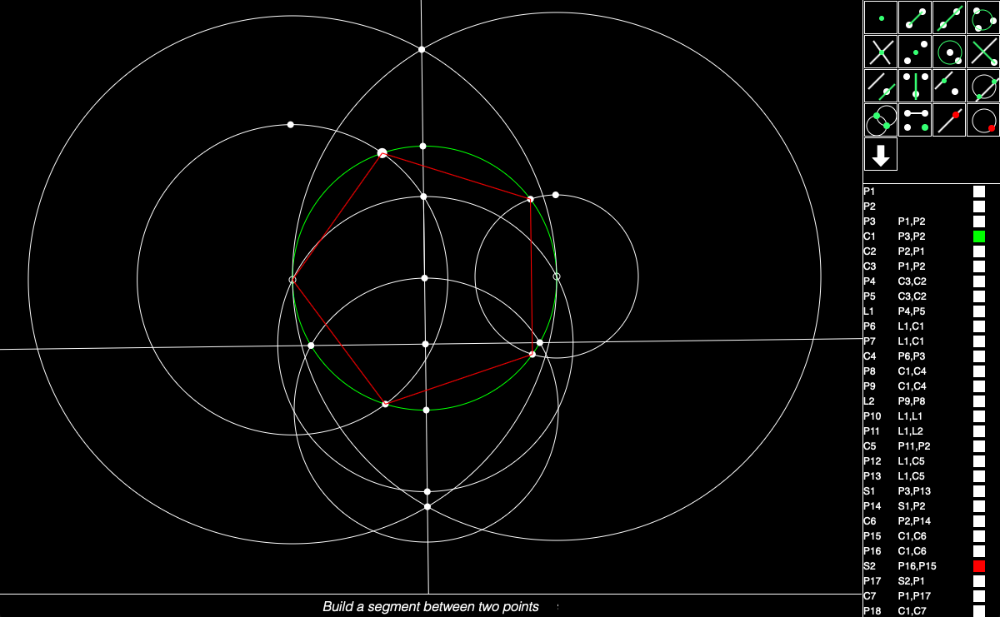
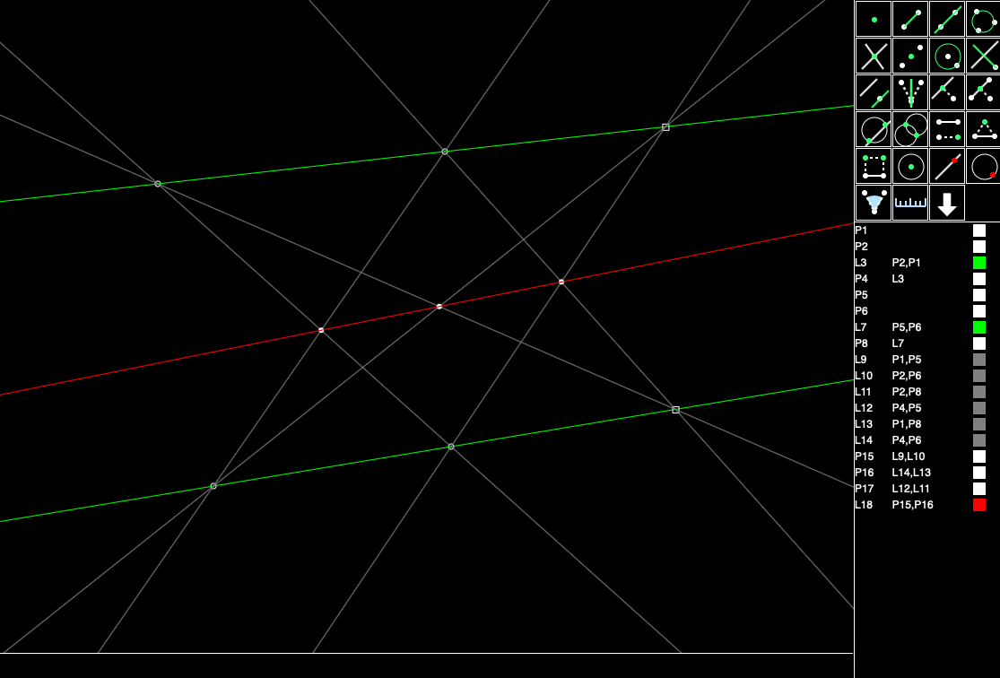

# Geometry Construction Set

With this playground you can verify some fundamental geometric theorems :

* Demo 2: In a triangle the three medians intersect at the same point, the center of gravity.

* Demo 3: In a triangle the three heights intersect at the same point, the orthocenter.

* Demo 4: In a triangle the three bisectors intersect at the same point, the center of the inscribed circle.

* Demo 5: The three circles intersect at the same point, the Miquel point.

* Demo 6: In a triangle, the three mediators intersect at the same point, the center of the circumscribed circle.

* Demo 7: The middle sides of any quadrilateral form the Varignon parallelogram.

* Demo 8: Construction of a pentagon inscribed in a circle:

* Demo 9: In a triangle, the triangle formed by the midpoints of the sides has its sides parallel to the original triangle.

* Demo 10: The intersections of the four circles are cocyclical.

* Demo 11: The medians of the triangle (green) are the bisectors of the triangle (red) joining the middle of the sides.

* Demo 12: The perpendiculars to the sides of a quadrilateral passing through the middle of the opposite side intersect at the same point.

* Demo 15: Napoleon's theorem.

* Demo 16 : Desargues's theorem.

* Demo 17 : Pappus's theorem.

